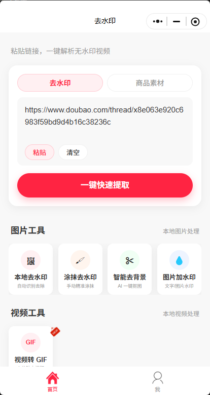
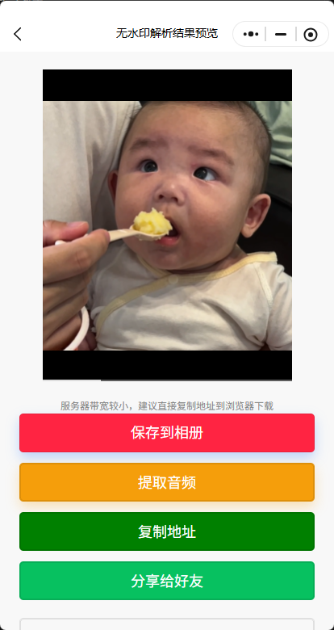

# remove-doubao-watermaker

> 豆包 AI 生成内容一键去水印 —— 微信小程序「速析去水印」

粘贴豆包 **thread 分享链接**，即可解析无水印视频，支持保存相册、复制下载地址、分享好友。无需安装 App，微信扫码即用。

<p align="center">
  
</p>

<p align="center">
  <strong>微信扫一扫，立即体验</strong>
</p>

---

## 效果预览

<table>
  <tr>
    <td align="center"><b>首页 · 粘贴链接解析</b></td>
    <td align="center"><b>结果页 · 无水印预览下载</b></td>
  </tr>
  <tr>
    <td></td>
    <td></td>
  </tr>
</table>

---

## 支持的链接格式

当前版本支持豆包 **`/thread/`** 形式的分享链接：

```text
https://www.doubao.com/thread/x8e063e920c6983f59bd9d4b16c38236c
```

> 从豆包 App 或网页复制「分享对话 / 创作」链接，只要包含 `/thread/` 即可解析。

---

## 使用步骤

1. **打开小程序** — 微信扫描上方小程序码，或在微信搜索「速析去水印」
2. **复制链接** — 在豆包中打开目标对话 / 创作，点击分享并复制链接
3. **粘贴解析** — 回到小程序首页，粘贴链接后点击「一键快速提取」
4. **保存内容** — 预览无水印结果，选择「保存到相册」「复制地址」或「提取音频」

---

## 核心功能

| 功能 | 说明 |
|------|------|
| 无水印视频解析 | 自动提取豆包 thread 中的 AI 生成视频，优先获取无水印版本 |
| 保存到相册 | 一键保存到手机相册（受微信文件大小限制） |
| 复制下载地址 | 服务器带宽有限时，可复制直链到浏览器下载 |
| 分享给好友 | 微信内快速转发解析结果 |

---

## 更多工具

除豆包去水印外，小程序还内置常用媒体处理工具：

**图片工具**

- 本地去水印 — 自动识别去除
- 涂抹去水印 — 手动精准涂抹
- 智能去背景 — AI 一键抠图
- 图片加水印 — 文字 / 图片水印

**视频工具**

- 视频转 GIF

---

## 常见问题

**Q：解析失败怎么办？**

- 确认链接是 `doubao.com/thread/...` 格式
- 确认分享内容未过期、未被删除
- 尝试重新复制完整链接（不要截断参数）

**Q：视频很大，保存失败？**

- 微信对小程序下载有体积上限，建议使用「复制地址」到浏览器下载

**Q：支持哪些平台？**

- 本仓库聚焦 **豆包 thread 链接** 去水印
- 小程序同时支持抖音、快手、小红书、B 站等多平台解析（详见完整项目）
---

## 免责声明

- 本工具仅供 **个人学习、研究** 使用
- 请尊重内容创作者与平台版权，勿将解析内容用于商业用途或二次传播
- 解析能力依赖豆包平台接口，若平台调整可能导致部分链接暂时不可用

---

## License

MIT
